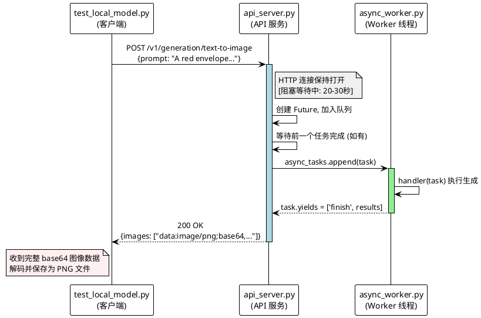

# Fooocus Text2Image 测试方案 - 端到端架构文档

## 1. 概述

本文档描述 Fooocus 文本到图像生成服务的完整测试方案，包括：
- Fooocus REST API 服务（自定义扩展）
- 任务队列机制
- 自动化测试框架
- 数据流和交互流程

---

## 2. 系统架构图

```
+------------------+     HTTP/REST      +------------------------+
|                  |  <------------->   |                        |
|  test_local_     |                   |   Cloud Studio (远程)    |
|  model.py        |                   |                        |
|  (测试客户端)     |                   |  +------------------+   |
|                  |                   |  |  Fooocus 实例     |   |
|                  |                   |  |  +-------------+  |   |
|                  |                   |  |  | Gradio WebUI|  |   |
|                  |                   |  |  +-------------+  |   |
|                  |                   |  |  +-------------+  |   |
|                  |                   |  |  | api_server  |  |   |
|                  |                   |  |  | .py         |  |   |
|                  |                   |  |  +-------------+  |   |
|                  |                   |  |  +-------------+  |   |
|                  |                   |  |  | async_worker|  |   |
|                  |                   |  |  | .py         |  |   |
|                  |                   |  |  +-------------+  |   |
|                  |                   |  +------------------+   |
|                  |                   |                        |
+------------------+                    +------------------------+

本地环境                                      远程服务器
```

---

## 3. 核心组件

### 3.1 api_server.py - REST API 服务

**位置**: `/workspace/AIGC/fooocus/myfork/api_server.py`

**职责**: 为 Fooocus 提供 REST API 接口，替代复杂的 Gradio WebSocket 调用

**技术栈**:
- FastAPI (Web 框架)
- Uvicorn (ASGI 服务器)
- Pydantic (数据验证)

**主要端点**:

| 端点                           | 方法 | 功能                        |
|--------------------------------|------|-----------------------------|
| `/`                            | GET  | API 信息（健康检查）        |
| `/api/health`                  | GET  | 健康检查                    |
| `/api/uptime`                  | GET  | 运行时间和资源信息          |
| `/api/generate`                | POST | 图像生成（标准格式）        |
| `/v1/generation/text-to-image` | POST | 图像生成（兼容格式）        |
| `/files`                       | GET  | 静态文件服务（output 目录） |

### 3.2 async_worker.py - 原生任务处理

**位置**: `/workspace/AIGC/fooocus/myfork/modules/async_worker.py`

**原始设计**:
```python
async_tasks = []  # 全局任务队列（列表）

def worker():
    """后台工作线程，循环处理任务"""
    while True:
        time.sleep(0.01)  # 10ms 轮询
        if len(async_tasks) > 0:
            task = async_tasks.pop(0)  # FIFO 取出
            handler(task)  # 同步阻塞执行
```

**关键特性**:
- 单线程顺序处理
- FIFO 队列机制
- 无并发支持（同一时间只有一个任务运行）

### 3.3 test_local_model.py - 测试客户端

**位置**: `/workspace/AIGC/text2image-tester/local_model/test_local_model.py`

**职责**: 自动化测试多种本地模型服务

**支持的模型**:
- Stable Diffusion WebUI (`/sdapi/v1/txt2img`)
- ComfyUI (`/prompt`, `/history/{id}`)
- **Fooocus** (`/v1/generation/text-to-image`) ← 我们的重点
- WebUI Forge (`/sdapi/v1/txt2img`)

---

## 4. 任务队列实现详解

### 4.1 问题背景

**原始问题**: 
- Fooocus 是单任务系统，同一时间只能处理一个图像生成请求
- 多个并发请求会导致冲突
- 原始实现返回 `409 Conflict` 错误

**需求**:
- 支持多个测试用例顺序执行
- 不需要客户端实现重试逻辑
- 保持与原始程序兼容

### 4.2 解决方案：FIFO 任务队列

```python
# api_server.py 核心实现

# 全局变量
pending_futures: List[asyncio.Future] = []  # 待完成的 Future 列表
queue_lock = asyncio.Lock()  # 队列锁

@app.post("/v1/generation/text-to-image")
async def generate_text_to_image_compat(request: FooocusCompatRequest):
    start_time = time.time()
    
    # 1. 创建 Future 用于等待
    task_future = asyncio.Future()
    
    # 2. 加入队列并获取位置
    async with queue_lock:
        pending_futures.append(task_future)
        queue_position = len(pending_futures)
    
    # 3. 如果不是第一个，等待前一个完成
    if queue_position > 1:
        print(f'[API] Task queued at position {queue_position}, waiting...')
        await asyncio.wait_for(pending_futures[queue_position - 2], timeout=600)
    
    try:
        # 4. 执行实际生成
        result = await call_fooocus_generate(internal_request)
        return result
    finally:
        # 5. 标记完成，通知下一个任务
        if not task_future.done():
            task_future.set_result(True)
        async with queue_lock:
            pending_futures.remove(task_future)
```

### 4.3 工作流程

```
时间线:
---------------------------------------------------------------->
请求1: [加入队列] -> [立即执行] -> [完成] -> [通知Future]
请求2:           [加入队列] -> [等待F1] -> [执行] -> [完成] -> [通知]
请求3:                     [加入队列] -> [等待F2] -> [执行] -> ...
```

**特点**:
- 客户端无需知道排队机制（透明）
- 最多等待 10 分钟（超时返回 504）
- FIFO 顺序保证
- 异步非阻塞（使用 asyncio.Future）

---

## 4.5 同步阻塞请求模型（核心设计决策）

### 4.5.1 设计原则：每个请求自动阻塞等待结果

**当前实现采用同步阻塞模式**，这是整个方案的核心设计选择。

#### 行为特征

**Mermaid 序列图格式** (GitHub/GitLab 原生渲染):

```mermaid
sequenceDiagram
    participant C as test_local_model.py<br/>(客户端)
    participant A as api_server.py<br/>(API 服务)
    participant W as async_worker.py<br/>(Worker 线程)

    C->>A: POST /v1/generation/text-to-image<br/>{prompt: "A red envelope..."}
    activate A
    
    Note over A,C: HTTP 连接保持打开<br/>[阻塞等待中: 20-30秒]
    
    A->>A: 创建 Future, 加入队列
    A->>A: 等待前一个任务完成 (如有)
    
    A->>W: async_tasks.append(task)
    activate W
    W->>W: handler(task) 执行生成
    W-->>A: task.yields = ['finish', results]
    deactivate W
    
    A-->>C: 200 OK<br/>{images: ["data:image/png;base64,..."], success: true}
    deactivate A
    
    Note over C: 收到完整 base64 图像数据<br/>解码并保存为 PNG 文件
```

**ASCII 备选格式**:

```
客户端 (test_local_model.py)                    服务器 (api_server.py)
       |                                              |
       |-- POST /v1/generation/text-to-image -------->|
       |    {prompt: "A red envelope..."}              |
       |                                              |
       |         [HTTP 连接保持打开]                    |
       |         [阻塞等待中...]                        |
       |         (通常 20-30 秒/张)                    |
       |                                              |
       |<-- 200 OK {images: [...], success: true} ----|
       |         (收到完整的 base64 图像数据)           |
       |                                              |
```

**PlantUML 格式** (需 PlantUML 工具渲染):



**关键点：**
- **自动排队** - 如果前面有任务在运行，新请求会自动加入队列并等待
- **阻塞等待** - HTTP 连接保持打开，直到图像生成完成
- **返回完整结果** - 一次性返回所有生成的图像数据（base64 编码）
- **对客户端透明** - 客户端只需发送一次 POST 请求，无需轮询或重试

### 4.5.2 代码级工作流

```python
# api_server.py - 服务端处理逻辑

@app.post("/v1/generation/text-to-image")
async def generate_text_to_image_compat(request: FooocusCompatRequest):
    start_time = time.time()
    
    # 步骤 1: 创建 Future 并加入队列
    task_future = asyncio.Future()
    async with queue_lock:
        pending_futures.append(task_future)
        queue_position = len(pending_futures)
    
    # 步骤 2: 如果不是队列中的第一个，等待前一个完成
    #        (这里会阻塞 HTTP 响应)
    if queue_position > 1:
        print(f'[API] Task queued at position {queue_position}, waiting...')
        await asyncio.wait_for(pending_futures[queue_position - 2], timeout=600)
    
    try:
        # 步骤 3: 执行实际的图像生成
        #        (这里也会阻塞，直到 worker 线程完成任务)
        result = await call_fooocus_generate(internal_request)
        
        # 步骤 4: 返回结果给客户端
        return {
            "images": result.get("images", []),
            "success": True,
            "processing_time": time.time() - start_time
        }
    
    finally:
        # 步骤 5: 标记本任务完成，唤醒队列中的下一个任务
        if not task_future.done():
            task_future.set_result(True)
```

```python
# test_local_model.py - 客户端调用逻辑

def generate(self, prompt, negative_prompt="", ...):
    start_time = time.time()
    
    payload = {
        "prompt": prompt,
        "negative_prompt": negative_prompt,
        ...
    }
    
    # 发送 POST 请求 - 这里会阻塞 20-30 秒
    response = requests.post(
        f"{self.url}/v1/generation/text-to-image",
        json=payload,
        timeout=300  # 设置 5 分钟超时保护
    )
    response.raise_for_status()
    result = response.json()
    
    # 处理返回的图像数据
    for img_data in result["images"]:
        self.save_image_from_base64(img_data, filepath)
    
    return {"success": True, "images": saved_images, ...}
```

### 4.5.3 时间线示例

假设每个图像生成需要 25 秒：

```
时间轴: 0s      25s      50s      75s      100s     125s     ...
       |        |        |        |         |        |
请求 A: [========执行=========]→ 返回结果 (25s)
请求 B:          [==排队等待==][========执行=========]→ 返回结果 (50s)
请求 C:                    [==排队等待==][========执行=========]→ 返回结果 (75s)
请求 D:                              [==排队等待==][========执行=========]→ 返回结果 (100s)
...

总耗时计算:
- 12 个测试用例 × 25秒/用例 = ~300 秒（约 5 分钟）
- 加上排队等待时间 ≈ 总共 5-6 分钟
```

### 4.5.4 为什么选择同步阻塞而非异步模式？

| 对比维度         | 同步阻塞（当前方案）             | 异步模式（task_id + 轮询）                     |
|------------------|----------------------------------|------------------------------------------------|
| **客户端复杂度** | 简单：一次 `requests.post()`     | 复杂：提交 → 轮询 → 获取结果                   |
| **错误处理**     | 直观：直接看 HTTP 状态码和响应体 | 需要处理多种状态（pending/running/done/error） |
| **超时控制**     | 简单：`timeout=300` 参数         | 需要自定义超时重试逻辑                         |
| **代码行数**     | ~10 行核心代码                   | ~50+ 行（提交、查询、重试、状态机）            |
| **适用场景**     | 批量顺序测试、简单集成           | 高并发、长耗时任务、实时进度显示               |

**选择同步的原因：**

1. **测试脚本需求匹配**
   - `test_local_model.py` 需要顺序执行 12 个测试用例
   - 每个用例独立，不需要并行提交
   - 需要立即知道成功/失败以便记录报告

2. **实现简洁性**
   - Python 的 `requests` 库天然支持同步 HTTP 调用
   - 无需引入额外的异步客户端库（如 httpx/aiohttp）
   - 错误处理直观：`try-except` 包裹即可

3. **与原始 WebUI 一致**
   - Gradio WebUI 也是"提交 → 等待 → 显示结果"
   - 只是 WebUI 通过 WebSocket 显示进度条
   - 我们的 API 本质上相同，只是没有中间的进度反馈

4. **调试友好**
   - 可以用 `curl` 直接测试：
     ```bash
     curl -X POST https://<url>/v1/generation/text-to-image \
       -H "Content-Type: application/json" \
       -d '{"prompt":"a cat"}'
     # 直接看到结果或错误
     ```

### 4.5.5 性能影响分析

**优点：**
- ✅ 避免了轮询开销（不需要每秒查询一次状态）
- ✅ 减少网络往返次数（1 次请求 vs N 次轮询）
- ✅ 服务器资源利用更高效（连接复用）

**缺点：**
- ❌ HTTP 连接长时间占用（20-30 秒/请求）
- ❌ 对高并发场景不友好（大量长连接消耗服务器资源）
- ❌ 无法提供实时进度反馈（除非升级为 SSE/WebSocket）

**适用性评估：**
- ✅ 当前场景（单客户端、批量测试）：**完全适合**
- ❌ 生产环境（多用户并发）：需考虑升级为异步模式

### 4.5.6 与其他 API 设计的对比

**OpenAI DALL-E 风格（异步 + 轮询）：**
```python
# 提交任务
POST /v1/images/generations → {"task_id": "abc123", "status": "pending"}

# 轮询状态
GET /v1/tasks/abc123 → {"status": "processing", "progress": 45%}

# 获取结果
GET /v1/tasks/abc123 → {"status": "completed", "image_url": "..."}
```

**我们的风格（同步阻塞）：**
```python
# 一步到位
POST /v1/generation/text-to-image → {"images": ["data:image/png;base64,..."], "success": true}
```

**结论：** 对于自动化测试场景，同步模式更实用；对于生产级多用户服务，异步模式更合适。

---

## 5. 数据流详解

### 5.1 请求流程

```
test_local_model.py                    api_server.py              async_worker.py
       |                                    |                          |
       |-- POST /v1/generation/text-to-image -------------------------->|
       |                                    |                          |
       |<------------------------------------|                          |
       |     (等待中...)                      |                          |
       |                                    |                          |
       |<-- JSON {images: ["data:image/png;base64,..."]} -------------|
       |                                    |                          |
       |-- base64 decode & save file -------|                          |
       |                                    |                          |
```

### 5.2 请求格式

**输入** (FooocusCompatRequest):
```json
{
  "prompt": "A red envelope with Chinese text '春节快乐'",
  "negative_prompt": "",
  "style_selections": ["Fooocus V2"],
  "performance_selection": "Speed",
  "aspect_ratios_selection": "1024*1024",
  "image_number": 1,
  "image_seed": -1,
  "steps": 20
}
```

**输出**:
```json
{
  "images": [
    "data:image/png;base64,iVBORw0KGgoAAAANSUhEUgAA..."
  ],
  "success": true,
  "processing_time": 27.5
}
```

### 5.3 参数转换链

```
API 输入 ("1024*1024") 
    ↓  build_args_from_request()
内部参数 ("1024×1024", Unicode ×)
    ↓  AsyncTask(args)
Worker 处理 (handler 函数)
    ↓  结果收集
输出文件 (outputs/*.png)
    ↓  base64 编码
API 返回 ("data:image/png;base64,...")
    ↓  客户端解码
保存文件 (fooocus_*.png)
```

---

## 6. 关键设计决策

### 6.1 为什么选择独立文件而非修改源码？

| 方案                         | 优点                       | 缺点             |
|------------------------------|----------------------------|------------------|
| **独立文件 (api_server.py)** | 易于维护、可回滚、最小侵入 | 需要额外启动代码 |
| 修改 async_worker.py         | 直接集成                   | 难以升级、风险高 |

**决策**: 选择独立文件方案

### 6.2 为什么使用 asyncio.Future 而不是简单锁？

| 方案               | 特点                        |
|--------------------|-----------------------------|
| 全局锁 (task_lock) | 返回 409 错误，客户端需重试 |
| **asyncio.Future** | 客户端透明等待，自动排队    |

**决策**: 使用 Future 实现真正的队列语义

### 6.3 分辨率参数为什么是 `*` 而不是 `×`？

**原因**:
- API 使用 ASCII 字符 `*`（URL 友好、易于输入）
- 内部 Handler 需要 Unicode 乘号 `×`（U+00D7）
- 转换在 `build_args_from_request()` 中自动完成

```python
aspect_ratio_for_handler = request.aspect_ratio.replace('*', '\u00d7')
```

---

## 7. 部署架构

### 7.1 Cloud Studio 临时实例

```
Cloud Studio 环境
├── Python 3.x
├── PyTorch (CUDA)
├── Fooocus (源码部署)
│   ├── entry_with_update.py (入口)
│   ├── launch.py (启动逻辑)
│   ├── modules/
│   │   ├── async_worker.py (原生任务处理)
│   │   └── config.py (配置)
│   └── api_server.py (我们的 REST API) ← 新增
├── outputs/ (生成的图像)
└── 临时 URL: https://xxx--7866.ap-shanghai2.cloudstudio.club/
```

### 7.2 启动命令

```bash
python entry_with_update.py --always-cpu --enable-api --api-port 8888
```

**参数说明**:
- `--always-cpu`: 强制使用 CPU（可选，用于调试）
- `--enable-api`: 启动 REST API 服务
- `--api-port 8888`: API 监听端口

### 7.3 会话限制

- **最大时长**: 10 分钟（Cloud Studio 限制）
- **监控**: `/api/uptime` 端点提供剩余时间
- **自动清理**: 超时后实例销毁

---

## 8. 测试执行流程

### 8.1 fooocus1.sh 脚本

```bash
#!/bin/bash
set -x

# 配置 Fooocus URL
URL=https://9ef092a8d7034c349e5bd1a0c7668a8d--7866.ap-shanghai2.cloudstudio.club/

# 检查 uptime
curl $URL/api/uptime

# 执行测试
./test_local_model.py --fooocus-url $URL
```

### 8.2 测试步骤

1. **健康检查**
   ```python
   def check_available(self):
       response = requests.get(f"{self.url}/")
       return response.status_code == 200
   ```

2. **加载提示词**
   - 从 `shared/prompts_default.json` 加载 12 个测试用例
   - 分类：文字渲染(A)、人像(B)、指令遵循(C)、产品(D)、艺术(E)

3. **顺序生成**
   ```python
   for prompt in prompts:
       result = tester.generate(prompt["text"], prompt["negative"])
       time.sleep(0.5)  # 短暂间隔
   ```

4. **保存结果**
   - 解码 base64 → 保存为 PNG
   - 生成报告 `local_test_report.json`

### 8.3 输出示例

```
Local Model Text2Image Tester
Solutions: ['fooocus']
Prompts: 12
Output: /workspace/AIGC/text2image-tester/output_local

[OK] Fooocus available at https://...

============================================================
Testing: Fooocus
============================================================
[Fooocus] Generating: A red envelope with the Chinese text...
  [A1] SUCCESS (28.5s) -> output_local/fooocus_20260527_071500_0.png
[Fooocus] Generating: A minimalist coffee shop logo...
  [A2] SUCCESS (26.3s) -> output_local/fooocus_20260527_071530_0.png
...

Summary: 12/12 successful
```

---

## 9. 故障排查指南

### 9.1 常见错误

| 错误                 | 原因                  | 解决方案                               |
|----------------------|-----------------------|----------------------------------------|
| `404 Not Found`      | API 未启动或 URL 错误 | 检查 `--enable-api` 参数               |
| `409 Conflict`       | 旧版本无队列支持      | 更新 api_server.py 并重启              |
| `Incorrect padding`  | Base64 解码失败       | 更新 test_local_model.py 处理 data URI |
| `504 Timeout`        | 队列等待超时          | 减少任务数或增加超时时间               |
| `Connection refused` | 实例未就绪            | 等待启动完成或检查日志                 |

### 9.2 调试技巧

```bash
# 1. 检查 API 是否可用
curl https://<instance-url>/api/uptime

# 2. 手动测试生成
curl -X POST https://<instance-url>/v1/generation/text-to-image \
  -H "Content-Type: application/json" \
  -d '{"prompt":"test","aspect_ratio":"512*512"}'

# 3. 查看生成的文件
curl https://<instance-url>/files/
```

---

## 10. 未来改进方向

### 10.1 功能增强

- [ ] 支持批量任务提交（一次提交多个 prompt）
- [ ] 添加 WebSocket 进度推送（实时显示生成进度）
- [ ] 支持任务取消（中断正在运行的任务）
- [ ] 添加速率限制（防止滥用）

### 10.2 性能优化

- [ ] 缓存常用模型权重
- [ ] 支持 GPU 多实例并行
- [ ] 图片压缩传输（减少带宽）

### 10.3 可靠性

- [ ] 断点续传（实例重启后恢复任务）
- [ ] 结果持久化（存储到对象存储）
- [ ] 健康检查自动重试

---

## 附录 A: 文件清单

| 文件                                                | 用途                                   |
|-----------------------------------------------------|----------------------------------------|
| `fooocus/myfork/api_server.py`                      | REST API 服务主文件                    |
| `fooocus/myfork/args_manager.py`                    | CLI 参数定义（添加了 --enable-api 等） |
| `fooocus/myfork/launch.py`                          | 启动逻辑（集成 API 服务）              |
| `text2image-tester/local_model/test_local_model.py` | 测试客户端                             |
| `text2image-tester/local_model/fooocus1.sh`         | Fooocus 测试脚本                       |
| `text2image-tester/shared/prompts_default.json`     | 测试提示词数据                         |

---

## 附录 B: 版本历史

| 版本 | 日期       | 变更                                 |
|------|------------|--------------------------------------|
| v1.0 | 2026-05-27 | 初始版本：基础 API + 任务队列        |
| v1.1 | 2026-05-27 | 添加 /api/uptime、静态文件服务       |
| v1.2 | 2026-05-27 | 实现 FIFO 任务队列、修复 base64 解码 |

---

*文档更新时间: 2026年5月27日*
